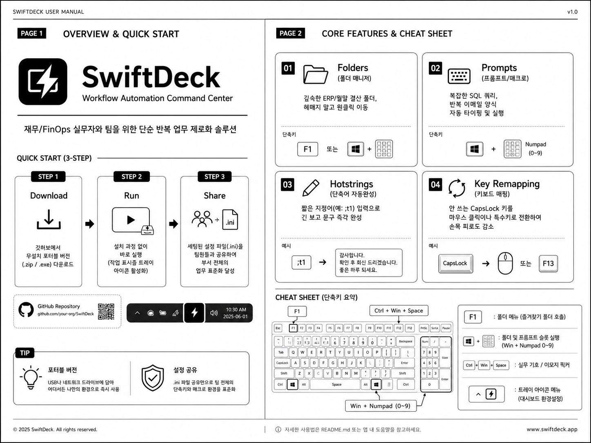

*Read this in other languages: [English](README.md), [한국어](README.ko.md)*

# ⚡ SwiftDeck: FinOps & Office Workflow Automation Suite
A Professional Productivity Command Center for Finance Managers & Business Professionals (Built with AutoHotkey v2)

  

---

I am **not a professional software developer, but a Financial Manager performing hands-on operations in a corporate finance department.**  
Watching the daily repetitive tasks—complex ERP inquiries, searching for scattered month-end closing folders, and writing routine emails—I started this project with a fierce question: **"Is there [...]

By directly analyzing the real-world pain points and operational bottlenecks of my colleagues, **SwiftDeck** has evolved from a simple personal macro script into an **office automation platform that s[...]

> **Accelerate Team Month-End Closings · Prevent Human Errors · Zero Repetitive Tasks · Standardize Workflows**  
Designed to maximize synergy for the entire department beyond just individual efficiency, this is a practical automation tool built by professionals, for professionals.

---

# 🚀 Download & Quick Start

**SwiftDeck** is a **portable application** that works instantly with a simple double-click, requiring no tedious installation process.  
It is designed for rapid deployment so that team members without programming knowledge or complex PC setups can utilize it immediately.

### 📥 For General Users (1-Click Portable Download)
1. Go to the **[Releases](https://github.com/KwangBeomPark/SwiftDeck/releases)** tab on the right side of the GitHub repository.
2. Download the latest **`SwiftDeck.zip`** or the standalone **`SwiftDeck.exe`** file.
3. Unzip and double-click **`SwiftDeck.exe`**. A black lightning bolt icon will activate in your Windows system tray, and it's ready to use instantly!
   - *💡 **Team Productivity Tip**: A manager can configure commonly used reporting formats (Prompts) or shared network paths (Folders) in the dashboard. By distributing the generated `.ini` configu[...]

### 🛠️ For Power Users & Developers (Custom Build)
This software is **100% open-source** with fully transparent code. If you wish to add custom formulas or advance its features, follow these steps:
1. Install [AutoHotkey v2](https://www.autohotkey.com/).
2. Clone this repository and customize the `App02_FolderHotKey_v8.1.ahk` source code to your needs.
3. Run the included `compile_app.cmd` tool in the source folder to package your own custom `SwiftDeck.exe` with your own metadata and icon.

---

# 💼 Practical FinOps & Business Use Cases

- **📂 1-Click Folder Navigation**: Stop wandering through deep network drives, ERP download folders, and monthly evidence directories. Open them instantly via the F1 hotkey menu or custom shortcuts[...]
- **⌨️ SQL Query & Macro Automation**: Trigger long, complex SQL queries or frequently used AI prompts with a single shortcut. SwiftDeck will type it out and hit enter for you seamlessly.
- **📧 Standardized Email Templates & Snippets**: Expand long daily cash reports, budget adjustment requests, or special characters in 0.1 seconds using text auto-complete (Hotstrings).
- **🖱️ Keyboard & Mouse Fatigue Relief (Key Remapping)**: For professionals doing copy-paste and clicking all day, remap rarely used keys (like CapsLock) into mouse clicks or specialized shor[...]

---

# 📖 User Manual
✔ **📁 Folders**: Manage and quick-jump to frequently used folder paths  
✔ **⌨️ Prompts**: Execute repetitive text strings and special control key macros (Wait, Enter, Tab)  
✔ **✏️ Hotstrings**: Register text abbreviations for instant auto-completion  
✔ **🔀 Key Remap**: Custom map physical keys to more useful shortcuts or mouse clicks  
✔ **⚙️ General**: Toggle 'Run on Windows Startup' and manage dark themes  

  

---

# ⌨️ Essential Shortcuts & Controls

| Shortcut | Function |
|---------|------|
| `F1` (Default) | **Favorite Folders Menu** Pop up your designated folder menu from anywhere |
| `Win + Numpad (0~9)` | **Folder & Prompt Slots** Instantly execute 10 registered slots |
| `;abbreviation` (e.g., `;t1`) | **Text Auto-Complete (Hotstring)** Instantly expand into long text/emails |
| `Ctrl + Win + Space` | **Emoji & Symbol Picker** Quickly input practical symbols and emojis |
| `System Tray Menu` | **⚙️ App Settings** Open the sleek dark-themed dashboard settings |

---

# 💻 Environment & License
🖥️ **Environment**: Windows 10 / 11 (AutoHotkey v2 runtime or compiled standalone executable)  
📄 **License**: MIT License (SwiftDeck is open-source and free to modify and distribute.)

---

## ☕ Support Practical Automation with a Coffee
If this tool has reduced your month-end closing hours or eased your wrist pain, your warm support is the greatest motivation for developing smarter and more innovative open-source finance automati[...]

  

